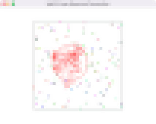
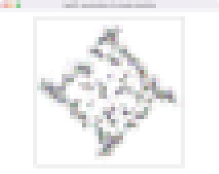
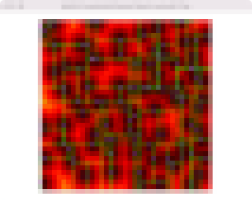
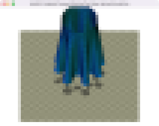
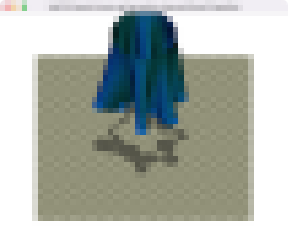
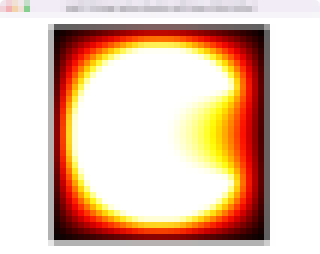
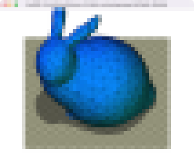
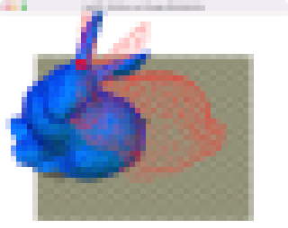

# Physics-based Animation 4860-1081 2023S

Lecture at graduate school of information science and technology in the university of Tokyo, spring semester, 2023

#### ITC-LMS 

For Slack and GitHub Classroom invitations

- https://itc-lms.ecc.u-tokyo.ac.jp/lms/course?idnumber=20214860-10810F01

#### Instructor
Dr. Nobuyuki Umetani 
- email: umetani@ci.i.u-tokyo.ac.jp
- url: http://www.nobuyuki-umetani.com/
- lab's website: https://cgenglab.github.io/en/

#### Time
- Monday 2rd period, 10:25pm - 12:10pm

#### Course Description

Computer-generated images are everywhere in movies, video games, and VR. This course is an introduction to the techniques to animate objects in computer graphics based on the law of physics. The aim of the course is to get familiar with applied mathematics such as linear algebra, vector analysis, partial differential equations, variational principle, optimization, and numerical analysis through the animation techniques for particle systems, rigid bodies, elastic bodies. There are C++/Python programming assignments to acquire research-oriented graphics programming skills. 

Topics:
- mass-spring simulation
- rigid body simulation
- elastic body simulation
- cloth and hair modeling & simulation
- collision-detection using spatial hashing
- finite boundary method

## Lecture Schedule

| Day | Topic | Assignment | Slide |
|:----|:---|:---|-----|
| (1)  Apr. 10 | **Introduction**  |  | [[1]](http://www.nobuyuki-umetani.com/pba2023s/introduction.pdf) |
| (2)  Apr. 17 | **Data Structure** data structure for simulation Implicit surface | [task00](task00/README.md) | [[2]](http://www.nobuyuki-umetani.com/pba2023s/data_structure.pdf) |
| (3)  Apr. 24 | **Time Integration**  backward & forward Euler method,  particle system | [task01](task01/README.md) | [[6]](http://www.nobuyuki-umetani.com/pba2023s/time_integration.pdf) |
| (4)  May 1 | **Newtonian Mechanics** | [task02](task02/README.md) |  [[5]](http://www.nobuyuki-umetani.com/pba2023s/newtonian_mechanics.pdf) |
| (5)  May 8 | **Collision Detection** principal component analysis sort & sweep method | [task03](task03/README.md) | [[9]](http://www.nobuyuki-umetani.com/pba2023s/collision_detection.pdf) |
| (6)  May 15 | **Optimization** bounding volume hierarchy Hessian & Jacobian | [task04](task04/README.md) | [[10]](http://www.nobuyuki-umetani.com/pba2023s/jacobian_hessian.pdf) |
| (7)  May 22 | **Simple Elastic Energy** Newton-Raphson method mass-spring system | [task05](task05/README.md) | [[12]](http://www.nobuyuki-umetani.com/pba2023s/mass_spring_system.pdf) |
| (8)  Jun. 5 | **Dynamic Deformation** Variational time integration  | [task06](task06/README.md) | [[14]](http://www.nobuyuki-umetani.com/pba2023s/variational_integration.pdf) |
| (9)  Jun. 12 | **Linear System Solver** Sparse matrix data structure Conjugate gradient method | [task07](task07/README.md) | [[17]](http://www.nobuyuki-umetani.com/pba2023s/optimization_with_constraints.pdf) |
| (10)  Jun. 19 | **Optimization with Constraint**  Lagrange multiplier method | [task08](task08/README.md) | [[18]](http://www.nobuyuki-umetani.com/pba2023s/rotation.pdf) |
| (11)  Jun. 26 | **Rotation** Rotation representation | [task09](task09/README.md) | [[18]](http://www.nobuyuki-umetani.com/pba2023s/rotation.pdf) |
| (12)  Jul. 3 | **Rigid Body Dynamics**  inertia tensor,  angular velocity | [task10](task10/README.md) | [[22]](http://www.nobuyuki-umetani.com/pba2023s/equation_of_rigid_body.pdf) |
| (13)  Jul. 10 | **Continuum Mechanics**  tensor,  finite element method |  | [[24]](http://www.nobuyuki-umetani.com/pba2023s/tensor.pdf) |

#### Slides

- [[1] Introduction](http://www.nobuyuki-umetani.com/pba2023s/introduction.pdf)
- [[2] Data Structure](http://www.nobuyuki-umetani.com/pba2023s/data_structure.pdf)
- [[3] Cpp](http://www.nobuyuki-umetani.com/pba2023s/cpp.pdf)
- [[4] Git](http://www.nobuyuki-umetani.com/pba2023s/git.pdf)
- [[5] Newtonian Mechanics](http://www.nobuyuki-umetani.com/pba2023s/newtonian_mechanics.pdf)
- [[6] Time Integration](http://www.nobuyuki-umetani.com/pba2023s/time_integration.pdf)
- [[7] Jagged Array](http://www.nobuyuki-umetani.com/pba2023s/jagged_array.pdf)
- [[8] Principal Component Analysis](http://www.nobuyuki-umetani.com/pba2023s/pca.pdf)
- [[9] Collision Detection](http://www.nobuyuki-umetani.com/pba2023s/collision_detection.pdf)
- [[10] Jacobian and Hessian](http://www.nobuyuki-umetani.com/pba2023s/jacobian_hessian.pdf)
- [[11] Vector Differentiation](http://www.nobuyuki-umetani.com/pba2023s/vector_differentiation.pdf)
- [[12] Mass-Spring System](http://www.nobuyuki-umetani.com/pba2023s/mass_spring_system.pdf)
- [[13] Optimization](http://www.nobuyuki-umetani.com/pba2023s/optimization.pdf)
- [[14] Variational Integration](http://www.nobuyuki-umetani.com/pba2023s/variational_integration.pdf)
- [[15] Matrix Data Structure](http://www.nobuyuki-umetani.com/pba2023s/matrix_data_structure.pdf)
- [[16] Linear System Solver](http://www.nobuyuki-umetani.com/pba2023s/linear_system_solver.pdf)
- [[17] Optimization with Constraints](http://www.nobuyuki-umetani.com/pba2023s/optimization_with_constraints.pdf)
- [[18] Rotation](http://www.nobuyuki-umetani.com/pba2023s/rotation.pdf)
- [[19] Grid & Mesh Interpolation](http://www.nobuyuki-umetani.com/pba2023s/grid_mesh_interpolation.pdf)
- [[20] Angular Velocity](http://www.nobuyuki-umetani.com/pba2023s/angular_velocity.pdf)
- [[21] Rigid Body Approximation](http://www.nobuyuki-umetani.com/pba2023s/rigid_body_approximation.pdf)
- [[22] Equation of Rigid Body](http://www.nobuyuki-umetani.com/pba2023s/equation_of_rigid_body.pdf) 
- [[23] Lagrangian Mechanics](http://www.nobuyuki-umetani.com/pba2023s/lagrangian_mechanics.pdf)
- [[24] Tensor](http://www.nobuyuki-umetani.com/pba2023s/tensor.pdf)
- [[25] Finite Element Method](http://www.nobuyuki-umetani.com/pba2023s/finite_element_method.pdf)

## Grading

- 20% lecture attendance
  - Attendance is counted based on writing a secret keyword on LMS. The keyword is announced for each lecture.  
- 80% small assignments
  - see below

#### Assignments

There are many small programming assignments. To do the assignments, you need to create your own copy of this repository through **GitHub Classroom**.  These assignements needs to be submitted using **pull request** functionality of the GitHub. Look at the following document. 

[How to Submit the Assignments](doc/submit.md)

| Task ID                    | Title                        | Thumbnail                                  |
| :------------------------- | :--------------------------- | :----------------------------------------- |
| [task00](task00/README.md) | Building C++ Program with CMake |  |
| [task01](task01/README.md) | Implicit Time Integration    |  |
| [task02](task02/README.md) | Linear Momentum Conservation |  |
| [task03](task03/README.md) | Acceleration of N-body Simulation |  |
| [task04](task04/README.md) | Accelerated Nearest Search using Kd-Tree |  |
| [task05](task05/README.md) | Gradient Descent for Mass-Spring Simulation |  |
| [task06](task06/README.md) | Dynamic Mass-spring System using Variational Euler Time Integration |  |
| [task07](task07/README.md) | Solving Laplace Equation with Gauss-Seidel Method |  |
| [task08](task08/README.md) | Controlling Volume of a Mesh using Lagrange-Multiplier Method |  |
| [task09](task09/README.md) | Rotation and Energy Minimization |  |
| [task10](task10/README.md) | Simulation of Rigid Body Precession |  |

#### Policy

- Do the assignment by yourself. Don't share the assignments with others.
- Don't post the answers of the assignment on Slack 
- Late submission of an assignment is subject to grade deduction
- Score each assignment will not be open soon (instructor needs to adjust weights of the score later)

## Reading Material

- [Ten Min Physics (Youtube channel)](https://www.youtube.com/@TenMinutePhysics/videos)
- [Physically Based Modeling: Principles and Practice, Siggraph '97 Course notes by Dr. Baraff](http://www.cs.cmu.edu/~baraff/sigcourse/index.html)
- [Physics-Based Animation  by Kenny Erleben et al. (free textobook about rigid body dynamics)](https://iphys.wordpress.com/2020/01/12/free-textbook-physics-based-animation/)
- [Dynamic Deformables: Implementation and Production Practicalities, SIGGRAPH 2020 Courses](http://www.tkim.graphics/DYNAMIC_DEFORMABLES/)
- [Awesome Computer Graphics (GitHub)](https://github.com/luisnts/awesome-computer-graphics)
- [Skinning: Real-time Shape Deformation SIGGRAPH 2014 Course](https://skinning.org/)

#### My Past Lectures
- [Physics-based Animation 2021S](https://github.com/nobuyuki83/Physics-based_Animation_2021S)
- [Applied Computer Graphics 2022S](https://github.com/nobuyuki83/Applied_Computer_Graphics_2022S)
