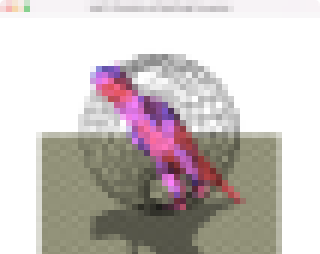

# Task10: Simulation of Rigid Body Precession

**Deadline: July 6th (Thu) at 15:00pm**

----

## Before Doing Assignment

If you have not done the [task00](../task00), do it first to set up the C++ graphics development environment.

Follow [this document](../doc/submit.md) to submit the assignment, In a nutshell, before doing the assignment,

- install `eigen` library following  [this document](../doc/setup_eigen.md)
- make sure you synchronized the `main ` branch of your local repository  to that of remote repository.
- make sure you created branch `task10` from `main` branch.
- make sure you are currently in the `task10` branch (use `git branch -a` command).

Now you are ready to go!

---

## Problem 1

Run the code. Take a screenshot image. 
Save the screenshot image overwriting `task10/problem1.png`

## Problem 2

This code simulates the motion of rigid body without any external force or translational movement.

Add some code around `line 108` to update the rotation matrix and the angular velocity.

The energy and the angular momentum should preserve for some extent.   

Wait until the program stops after simulating the motion until `time=200`. Save the screenshot image overwriting `task10/problem2.png`

## After Doing the Assignment

After modifying the code, push the code and submit a pull request.

## Notes

- Do not submit multiple pull requests. Only the first pull request is graded
- Do not close the pull request by yourself. The instructor will close the pull request
- If you mistakenly merge the pull request, it's OK, but be careful not to merge next time. 

## Credit

The `t-rex.obj` model was created by Thingiverse user HoShey, and is licensed under cc (https://www.thingiverse.com/thing:3152998).
